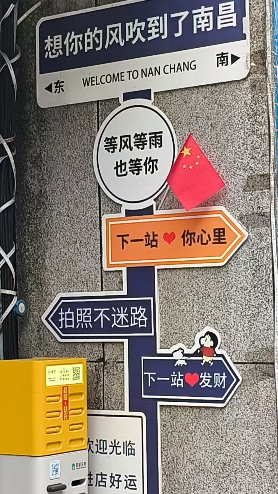
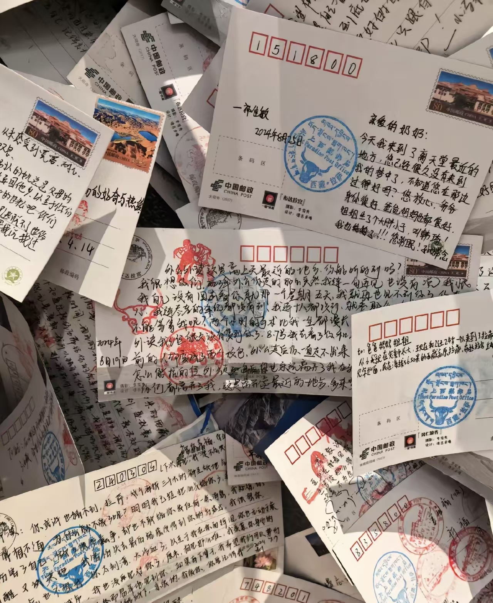
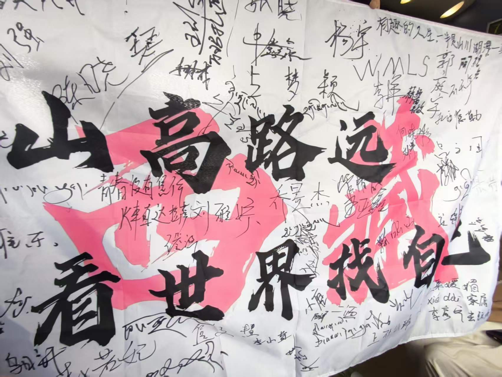

## 关于我

这里是我的个人博客，也不只是一个博客。

我记录写日常的工作、生活、相关的技术和感悟。

我更想做到的就是一个人好好的生活，经营好我的生活，不断的再体验中学习，生活就是不断的Get Better的过程。保持着进步的想法，多去关心身边的的人，帮助他人和得到认可亦是实现自我的一种方式。

这个博客之内会有方法、理解、生活日常的记录。也会有积攒的情绪爆发的时候，也是不可缺失的一部分，遇到问题，不能逃避，面对才是方法，即便是错了也没关系，反正逃避也是错误。这些都是我们一起所经历的事——**生活。**

## 开端

从第一次填报志愿滑档，感觉就是命中注定一样，选择了学校，选择了专业。在这期间，我也经历了自暴自弃，上大学的时候也完了很久，真的是很久啊，两年半，哈哈哈（我真不是小黑子）。

在意识到快要实习找工作但是自己什么都不会的时候才开始进行学习，也考虑过考研，考公或者继续学习技术去干硬件。换过很多方向，期间也遇到了很多人，亦师亦友，教会了我很多，不管对我怎么样，都让我学到了东西。最后呢，如大家所见，找到了实习，当上了程序员，甚至我在收到offer的时候我也是愣神的，真的是意料之外。但是我还是没变，还是那个什么都不懂，经常闯祸的傻小子。

## 日常的经历

- 寒暑假实习的时候去打过工干过安检，送过外卖，当过服务生，认识了许多朋友，更见到了各种形形色色的人
                           
  
摸鱼 ing
 
- 也和朋友一起做了设计，做了自己的硬件的玩具出来
！[AI小智](D:\http web\static\images\tools.jpg)
- 研究过 AI、自动化、系统搭建
- 写过文章，记录过思考

## 体验的生活
去了很多地方，镇江，西藏，新疆，南昌等等的地方，看到了许多风景，见到了久违的朋友，体验不同生活
                                                                                        
  
                                                                                        
  
  
                                                                                        
     

## 目前
现在来到了杭州进入公司成为了实习生，遇到了大佬，在工作的时候犯了很多错误，添了很多麻烦。
很多时候，觉得自己什么都不会，在这之后想要学习更多技术的想法就更加强烈，至少不想再拖后腿。

现在的我租着房子，每周准时上班，虽然两点一线，一点点枯燥，但是还是很满足的。
休息日的日常就是追番，出去闲逛，再看一看技术的一些技巧，微卷一下下，不然真的什么都不会啊!!!

做这个博客也是一个开始，想分享我的生活，还有一些技术的小技巧，希望能越来越熟练，把效率提高上来吧。

## 技术栈

- **语言**: Python、JavaScript
- **前端**: Hugo、基础 HTML/CSS
- **工具**: Git、VS Code、GitHub Actions
- **感兴趣**: AI Agent，小工具

## 开源项目

持续更新中，欢迎到 [GitHub](https://github.com/mikeliu30) 查看。

## 联系我

- GitHub: [mikeliu30](https://github.com/mikeliu30)

## 最后
如果有什么见解或者想法，大家也可以评论
结果固然重要，但是更重要的是过程，不断的试错，不断地摸爬滚打
我进入这个行业，也是意料之外，也许也是命中注定？这谁知道呢。
反正别停下就对了。
