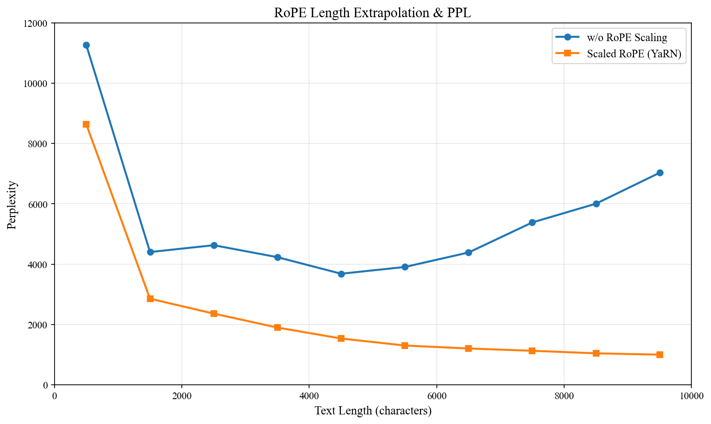
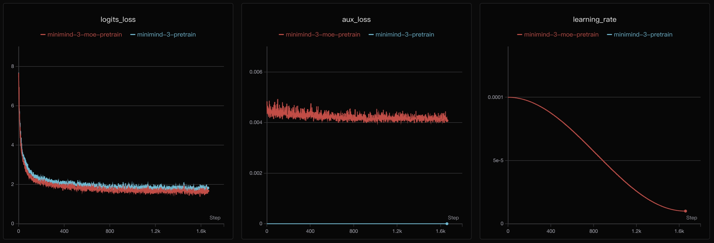
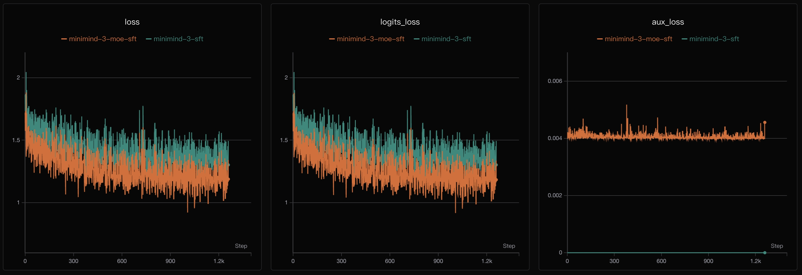
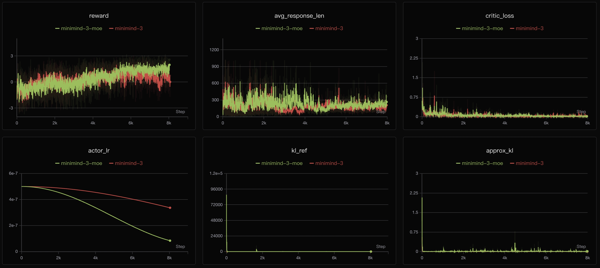
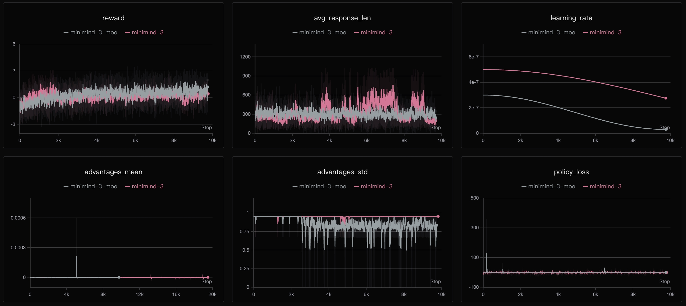
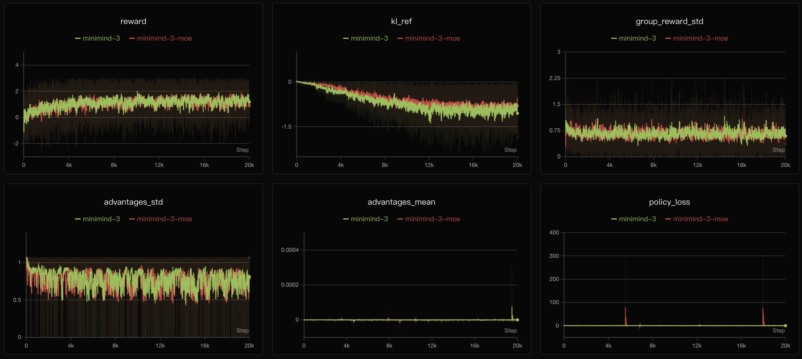
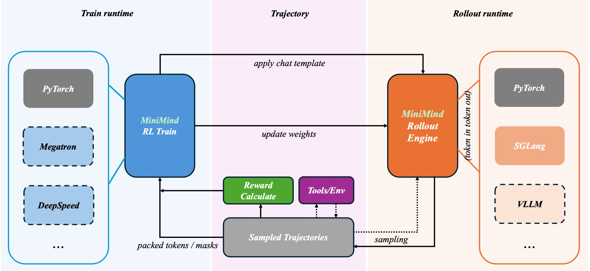
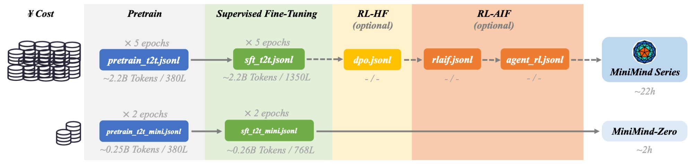
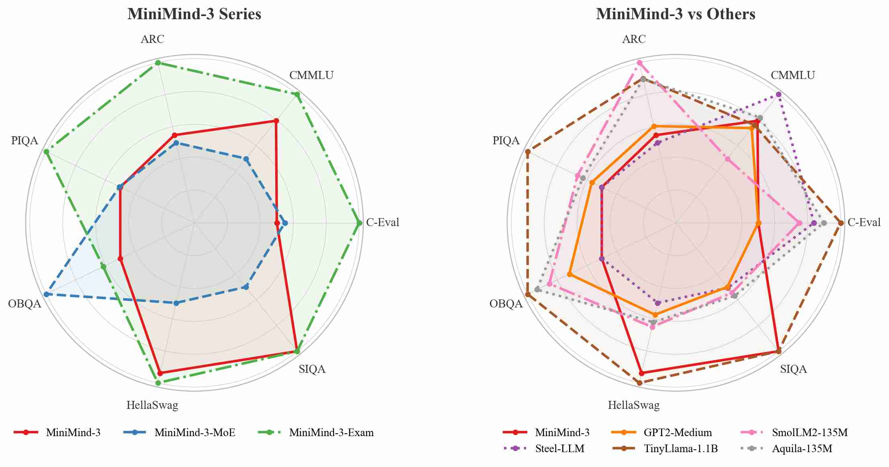
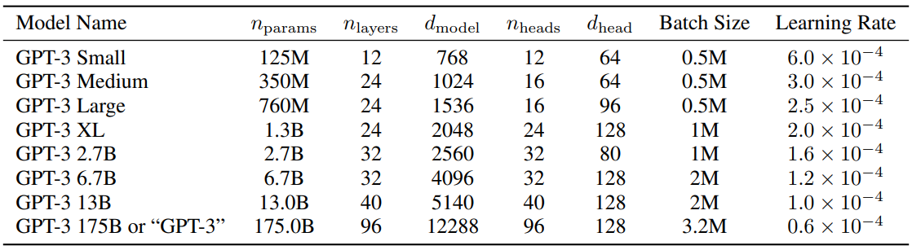

> 这篇文章基于参考项目的完整源码阅读整理，不是泛泛而谈，而是按真实工程结构逐段拆解。
>
> 参考仓库：`https://github.com/jingyaogong/minimind`
>
> 覆盖范围说明（先回答“是不是全部代码”）：
> - **不是逐行罗列仓库里每一行代码**，否则篇幅会失控，也不利于学习。
> - **是覆盖了完整训练链路的核心代码**：模型、数据、训练脚本、RL、rollout、推理、tokenizer。
> - 对新手最重要的“从哪里看、先跑什么、每一步会产出什么、出错怎么查”，本文都按工程流程展开。
---

## 目录

1. 项目定位与核心结论
2. 新手先看：文件结构与阅读顺序
3. 主模型源码拆解（Dense + MoE）
4. 数据集与标签构造逻辑
5. 训练工具层（lr / ckpt / DDP / resume）
6. 各训练阶段源码（Pretrain / SFT / LoRA / DPO / PPO / GRPO / Agent RL / Distill）
7. Rollout 引擎解耦（Torch / SGLang）
8. 推理脚本与部署路径
9. Tokenizer 脚本设计
10. README 里的关键实验图
11. 面向新手的完整实操步骤（含命令、代码入口、产物、排错）
12. 工程角度评价
---

## 一、先说结论：MiniMind 是什么

MiniMind 是一个“小而全”的 LLM 训练工程：

- **模型层**：手写 Decoder-only Transformer，支持 Dense 和 MoE
- **训练层**：覆盖 Pretrain / SFT / LoRA / DPO / PPO / GRPO / Agentic RL / Distillation
- **工程层**：支持 DDP、AMP、断点续训、rollout 引擎解耦
- **推理层**：支持本地 PyTorch 权重和 Transformers 权重

一句话总结：**它是一个可训练、可复现、可扩展的微型 LLM 全流程模板。**

---

## 二、新手先看：文件结构与阅读顺序

先记住一句话：**这个项目是按“模型定义 -> 数据处理 -> 训练脚本 -> 推理验证”组织的。**

### 2.1 文件结构（新手版）

```text
minimind/
├── model/
│   ├── model_minimind.py        # 模型本体（Transformer / Attention / FFN / MoE / generate）
│   └── model_lora.py            # LoRA 注入与合并
├── dataset/
│   └── lm_dataset.py            # 不同训练阶段的数据读取与标签构造
├── trainer/
│   ├── trainer_utils.py         # 训练公共工具（学习率、日志、保存、续训）
│   ├── train_pretrain.py        # 阶段1：预训练
│   ├── train_full_sft.py        # 阶段2：全参数 SFT
│   ├── train_lora.py            # 阶段2补充：LoRA SFT
│   ├── train_dpo.py             # 阶段3：偏好学习 DPO
│   ├── train_grpo.py            # 阶段4：GRPO/CISPO
│   ├── train_ppo.py             # 阶段4：PPO（Actor-Critic）
│   ├── train_agent.py           # 阶段5：Agentic RL（工具调用）
│   ├── train_distillation.py    # 阶段6：蒸馏
│   ├── train_tokenizer.py       # tokenizer 训练示例（学习用途）
│   └── rollout_engine.py        # rollout 引擎抽象层（torch/sglang）
├── eval_llm.py                  # 推理入口（加载权重并对话）
└── README.md                    # 官方说明与实验记录
```

### 2.2 新手阅读顺序（避免一上来迷路）

1. **先看 README.md**：知道项目要解决什么问题、有哪些训练阶段。
2. **再看 `model/model_minimind.py`**：明白“训练的对象到底长什么样”。
3. **看 `dataset/lm_dataset.py`**：明白“喂给模型的数据长什么样、标签怎么算”。
4. **看 `trainer/train_pretrain.py` + `trainer_utils.py`**：明白最基础训练循环。
5. **再按需求看 SFT / DPO / PPO / GRPO / AgentRL 脚本**。
6. **最后看 `eval_llm.py`**：验证模型是否真的能跑和能回答。

---

## 三、模型架构总览（`model/model_minimind.py`）

### 3.1 架构图（Dense / MoE）


### 3.2 配置类：MiniMindConfig

核心配置（简化后）：

```python
class MiniMindConfig(PretrainedConfig):
    def __init__(self, hidden_size=768, num_hidden_layers=8, use_moe=False, **kwargs):
        self.hidden_size = hidden_size
        self.num_hidden_layers = num_hidden_layers
        self.use_moe = use_moe
        self.vocab_size = kwargs.get("vocab_size", 6400)
        self.num_attention_heads = kwargs.get("num_attention_heads", 8)
        self.num_key_value_heads = kwargs.get("num_key_value_heads", 4)
        self.head_dim = kwargs.get("head_dim", self.hidden_size // self.num_attention_heads)
        self.max_position_embeddings = kwargs.get("max_position_embeddings", 32768)
        self.rope_theta = kwargs.get("rope_theta", 1e6)
```

要点：

- 典型配置：`hidden_size=768, layers=8`
- GQA：`q_heads=8, kv_heads=4`
- RoPE 长度到 `32768`
- `use_moe` 控制 FFN 路由到 Dense 或 MoE

### 3.3 RMSNorm

```python
def forward(self, x):
    return (self.weight * self.norm(x.float())).type_as(x)
```

使用 RMSNorm（非 LayerNorm）是现在很多 LLM 的常见做法：更轻，数值稳定。

### 3.4 RoPE + YaRN 外推

```python
freqs_cos, freqs_sin = precompute_freqs_cis(
    dim=config.head_dim,
    end=config.max_position_embeddings,
    rope_base=config.rope_theta,
    rope_scaling=config.rope_scaling
)
```

项目里支持 YaRN 形式的 rope scaling。对应 README 的实验图：



### 3.5 注意力层（Attention）

关键流程：

```python
xq, xk, xv = self.q_proj(x), self.k_proj(x), self.v_proj(x)
xq, xk = self.q_norm(xq), self.k_norm(xk)
xq, xk = apply_rotary_pos_emb(xq, xk, cos, sin)
```

打分与掩码：

```python
scores = (xq @ xk.transpose(-2, -1)) / math.sqrt(self.head_dim)
if self.is_causal:
    scores[:, :, :, -seq_len:] += torch.full((seq_len, seq_len), float("-inf"), device=scores.device).triu(1)
output = self.attn_dropout(F.softmax(scores.float(), dim=-1).type_as(xq)) @ xv
```

实现细节：

- QK-Norm
- KV cache 拼接
- GQA 的 repeat_kv
- 有条件走 Flash Attention

### 3.6 FFN 与 MoE

Dense FFN：

```python
return self.down_proj(self.act_fn(self.gate_proj(x)) * self.up_proj(x))
```

MoE FFN：

```python
scores = F.softmax(self.gate(x_flat), dim=-1)
topk_weight, topk_idx = torch.topk(scores, k=self.config.num_experts_per_tok, dim=-1, sorted=False)
```

负载均衡辅助损失：

```python
self.aux_loss = (load * scores.mean(0)).sum() * self.config.num_experts * self.config.router_aux_loss_coef
```

### 3.7 CausalLM 输出

```python
return MoeCausalLMOutputWithPast(
    loss=loss,
    aux_loss=aux_loss,
    logits=logits,
    past_key_values=past_key_values,
    hidden_states=hidden_states
)
```

其中：

- `loss`: next-token CE
- `aux_loss`: MoE router 辅助项

---

## 四、数据处理层（`dataset/lm_dataset.py`）

### 4.1 PretrainDataset

```python
tokens = self.tokenizer(str(sample['text']), add_special_tokens=False, max_length=self.max_length - 2, truncation=True).input_ids
tokens = [self.tokenizer.bos_token_id] + tokens + [self.tokenizer.eos_token_id]
labels[input_ids == self.tokenizer.pad_token_id] = -100
```

即标准语言建模：pad 位不算损失。

### 4.2 SFTDataset：最关键的标签掩码

`generate_labels()` 只把 assistant 响应段设置为监督目标，其余位置全是 -100。

```python
if input_ids[i:i + len(self.bos_id)] == self.bos_id:
    start = i + len(self.bos_id)
    ...
    for j in range(start, min(end + len(self.eos_id), self.max_length)):
        labels[j] = input_ids[j]
```

这一步决定了“模型学什么、不学什么”。

### 4.3 DPO / RLAIF / Agent RL 数据

- `DPODataset`：输出 chosen/rejected 两套序列
- `RLAIFDataset`：只喂 prompt，答案在线 rollout
- `AgentRLDataset`：`messages + tools + gt`，用于多轮工具强化学习

---

## 五、训练工具层（`trainer/trainer_utils.py`）

### 5.1 学习率策略

```python
def get_lr(current_step, total_steps, lr):
    return lr * (0.1 + 0.45 * (1 + math.cos(math.pi * current_step / total_steps)))
```

### 5.2 日志与主进程控制

```python
def is_main_process():
    return not dist.is_initialized() or dist.get_rank() == 0
```

### 5.3 Checkpoint 原子写入

```python
ckp_tmp = ckp_path + '.tmp'
torch.save(state_dict, ckp_tmp)
os.replace(ckp_tmp, ckp_path)
```

### 5.4 断点续训 + world_size 变化适配

```python
if saved_ws != current_ws:
    ckp_data['step'] = ckp_data['step'] * saved_ws // current_ws
```

多卡变化后自动换算步数，这是很实用的工程细节。

---

## 六、训练阶段逐脚本拆解

## 6.1 预训练（`train_pretrain.py`）

核心训练段：

```python
with autocast_ctx:
    res = model(input_ids, labels=labels)
    loss = res.loss + res.aux_loss
    loss = loss / args.accumulation_steps
scaler.scale(loss).backward()
```

训练曲线（README 提供）：



## 6.2 全参 SFT（`train_full_sft.py`）

与 pretrain 脚本同构，关键区别：

- 数据换成 `SFTDataset`
- 默认学习率更低（如 1e-5）

曲线：



## 6.3 LoRA 微调（`train_lora.py` + `model_lora.py`）

注入 LoRA：

```python
apply_lora(model)
```

冻结非 LoRA 参数：

```python
for name, param in model.named_parameters():
    if 'lora' in name:
        param.requires_grad = True
        lora_params.append(param)
    else:
        param.requires_grad = False
```

只优化 `lora_params`。

## 6.4 DPO（`train_dpo.py`）

```python
pi_logratios = chosen_policy_log_probs - reject_policy_log_probs
ref_logratios = chosen_ref_log_probs - reject_ref_log_probs
logits = pi_logratios - ref_logratios
loss = -F.logsigmoid(beta * logits)
```

DPO特点：

- 策略模型更新
- 参考模型冻结
- 不需要 critic
- 偏好学习成本比 PPO 低

## 6.5 PPO（`train_ppo.py`）

项目自定义 Critic：

```python
class CriticModel(MiniMindForCausalLM):
    def __init__(self, params):
        super().__init__(params)
        self.value_head = nn.Linear(params.hidden_size, 1)
```

GAE：

```python
delta = token_rewards[:, t] + args.gamma * nv - old_resp_values[:, t]
lastgaelam = delta + args.gamma * args.lam * lastgaelam
```

曲线：



## 6.6 GRPO / CISPO（`train_grpo.py`）

组内优势标准化：

```python
grouped_rewards = rewards.view(-1, args.num_generations)
mean_r = grouped_rewards.mean(dim=1).repeat_interleave(args.num_generations)
std_r = grouped_rewards.std(dim=1).repeat_interleave(args.num_generations)
advantages = (rewards - mean_r) / (std_r + 1e-4)
```

PPO 比率：

```python
ratio = torch.exp(per_token_logps - old_per_token_logps)
```

曲线：



## 6.7 Agentic RL（`train_agent.py`）

这是整个项目最“系统化”的部分之一。

### Agent Rollout 关键链路

1. 多轮生成 assistant 输出
2. 解析 `<tool_call>`
3. 执行模拟工具
4. 注入 `<tool_response>` 回上下文
5. 继续下一轮生成
6. 最终按轨迹算奖励

多轮 rollout 核心：

```python
completion, context, prompt_ids, response_ids, response_mask, response_old_logps, turn_outputs, unfinished = rollout_single(...)
```

奖励函数综合：

- 格式奖励
- 工具调用合法性奖励
- gt 命中奖励
- unfinished 惩罚
- 重复惩罚

对应曲线：



同时 README 提供了 Agent 结构示意：



---

## 七、Rollout 引擎抽象（`trainer/rollout_engine.py`）

统一接口：

```python
class RolloutEngine(ABC):
    @abstractmethod
    def rollout(...):
        pass
    @abstractmethod
    def update_policy(...):
        pass
```

两种实现：

- `TorchRolloutEngine`: 本地 generate
- `SGLangRolloutEngine`: HTTP 请求外部 sglang 服务

这意味着训练脚本不依赖具体推理后端，后续可继续扩展到更多引擎。

---

## 八、推理入口（`eval_llm.py`）

加载模式：

```python
if 'model' in args.load_from:
    # MiniMind 本地权重
else:
    # Transformers 模型
```

支持项：

- `--lora_weight` 叠加 LoRA
- `--open_thinking` 控制显式思考
- `--historys` 控制上下文轮数
- `--temperature / --top_p` 采样控制
- `--inference_rope_scaling` 长上下文外推

---

## 九、Tokenizer 训练脚本（`train_tokenizer.py`）

虽然官方建议“不重复训练 tokenizer”，但脚本非常有学习价值。

### 9.1 基础配置

- BPE 模型
- ByteLevel pre-tokenizer
- vocab size: 6400

```python
tokenizer = Tokenizer(models.BPE())
tokenizer.pre_tokenizer = pre_tokenizers.ByteLevel(add_prefix_space=False)
```

### 9.2 特殊 token

```python
"<tool_call>", "</tool_call>",
"<tool_response>", "</tool_response>",
"<think>", "</think>"
```

还会把 chat template 写入 tokenizer 配置，保持训练与推理模板一致。

---

## 十、README 里的关键实验图（已同步到本文）

### 10.1 数据组成图



### 10.2 Benchmark 雷达图



### 10.3 GPT-3 配置参考图



---

## 十一、面向新手的完整实操步骤（含命令、代码入口、产物、排错）

下面按“能跑通、能定位、能迭代”的目标，给出更细的执行模板。

### 10.1 第 0 步：准备项目与环境

```bash
git clone https://github.com/jingyaogong/minimind.git
cd minimind
```

你需要准备：

- Python 环境（建议单独 venv/conda）
- PyTorch + CUDA（如使用 GPU）
- 数据文件（确保 `dataset/` 下目标 jsonl 存在）

先做一次最小验证：

```bash
python -c "import torch; print(torch.__version__, torch.cuda.is_available())"
```

### 10.2 第 1 步：先读两个入口文件（5分钟建立全局认知）

1. `trainer/train_pretrain.py`
   - 你会看到完整训练循环：前向、loss、反向、梯度裁剪、保存
2. `trainer/trainer_utils.py`
   - 你会看到学习率、日志、checkpoint、续训逻辑

这一步的目的：先知道“训练脚本是怎么运转的”，再跑命令就不慌。

### 10.3 第 2 步：跑通预训练（Pretrain）

命令（在 `trainer/` 下执行）：

```bash
cd trainer
python train_pretrain.py --use_moe 0 --from_weight none
```

关键代码入口：

- 模型初始化：`init_model(...)`
- 数据加载：`PretrainDataset(...)`
- 训练主循环：`train_epoch(...)`

关键 loss 代码：

```python
with autocast_ctx:
    res = model(input_ids, labels=labels)
    loss = res.loss + res.aux_loss
```

你应该看到的产物：

- 权重文件（在 `out/` 或你设置的保存目录）
- 训练日志（包含 loss、lr）

常见报错排查：

- OOM：先减 `batch_size`，再减 `max_seq_len`
- loss NaN：先降低 `learning_rate`
- 读取数据失败：检查 `--data_path` 是否正确

### 10.4 第 3 步：跑通全参数 SFT

```bash
python train_full_sft.py --use_moe 0 --from_weight pretrain
```

你要重点看的代码：`dataset/lm_dataset.py` 里的 `SFTDataset.generate_labels()`。

核心逻辑是：只监督 assistant 的答案 token，其余位置设为 -100。

### 10.5 第 4 步：做低成本微调（LoRA）

```bash
python train_lora.py --use_moe 0 --from_weight full_sft
```

关键代码（只训练 LoRA 参数）：

```python
for name, param in model.named_parameters():
    if 'lora' in name:
        param.requires_grad = True
    else:
        param.requires_grad = False
```

为什么这步对新手友好：显存压力更低，调试成本更低。

### 10.6 第 5 步：偏好学习（DPO）

```bash
python train_dpo.py --use_moe 0 --from_weight lora
```

你要关注这个公式：

```python
logits = (chosen_policy_log_probs - reject_policy_log_probs) - (chosen_ref_log_probs - reject_ref_log_probs)
loss = -F.logsigmoid(beta * logits)
```

理解它，你就理解了 DPO 的核心：让策略模型在“偏好对”上相对参考模型更优。

### 10.7 第 6 步：强化学习（GRPO / PPO / Agent RL）

建议顺序：先 GRPO，再 PPO，最后 Agent RL。

```bash
python train_grpo.py --use_moe 0
python train_ppo.py --use_moe 0
python train_agent.py --use_moe 0
```

- `train_grpo.py`：组内标准化优势，结构更轻
- `train_ppo.py`：Actor-Critic + GAE，经典 RLHF 路线
- `train_agent.py`：多轮工具调用轨迹，最接近“可用 Agent”

### 10.8 第 7 步：蒸馏与最终推理

```bash
python train_distillation.py
python ../eval_llm.py --weight distillation
```

关键蒸馏损失：

```python
loss = alpha * ce_loss + (1 - alpha) * distill_loss
```

### 10.9 第 8 步：推理验证（确认模型真的可用）

常用推理命令：

```bash
python ../eval_llm.py --weight full_sft
python ../eval_llm.py --weight full_sft --lora_weight lora
```

重点参数：

- `--temperature` / `--top_p`：采样多样性
- `--historys`：上下文轮数
- `--inference_rope_scaling`：长上下文外推

### 10.10 一张“新手不迷路”路线图

1. 只跑 Dense：`pretrain -> full_sft -> eval`
2. 低成本增强：`lora -> dpo`
3. 再进 RL：`grpo -> ppo -> agent`
4. 最后轻量化：`distillation -> eval/deploy`

**不要一开始就 MoE，不要一开始就 Agent RL。**
先把最小闭环跑通，再逐步加复杂度，成功率最高。

---

## 十二、工程角度评价

### 优点

1. **链路完整**：不是单个脚本，而是完整训练系统
2. **源码可读性高**：适合学习 LLM 训练底层
3. **训练工程意识强**：断点续训、DDP、AMP、原子保存
4. **可扩展性好**：rollout 后端可插拔

### 局限

1. 小模型 RL 的 reward hacking 风险天然存在
2. MoE 在纯 PyTorch 下训练效率一般
3. Tool Use 泛化取决于数据覆盖范围

---

## 结语

MiniMind 的真正价值，不是参数量小，而是它把“模型训练这件事”从黑盒拆成了可直接阅读和修改的白盒代码。

如果你想从“会调 API”跨到“能看懂并改训练系统”，这个项目是很好的跳板。
