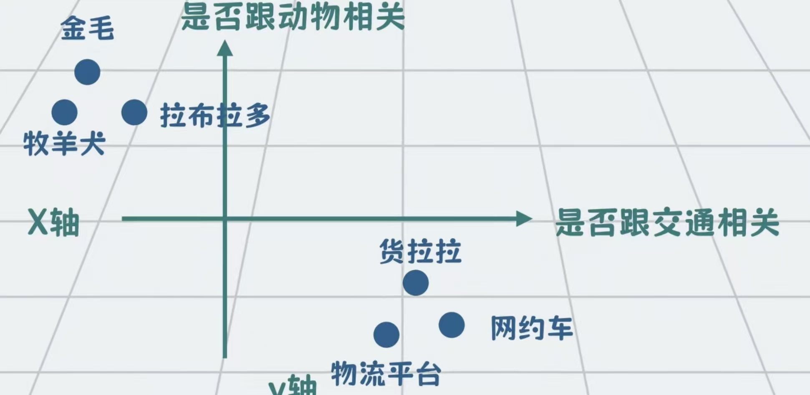
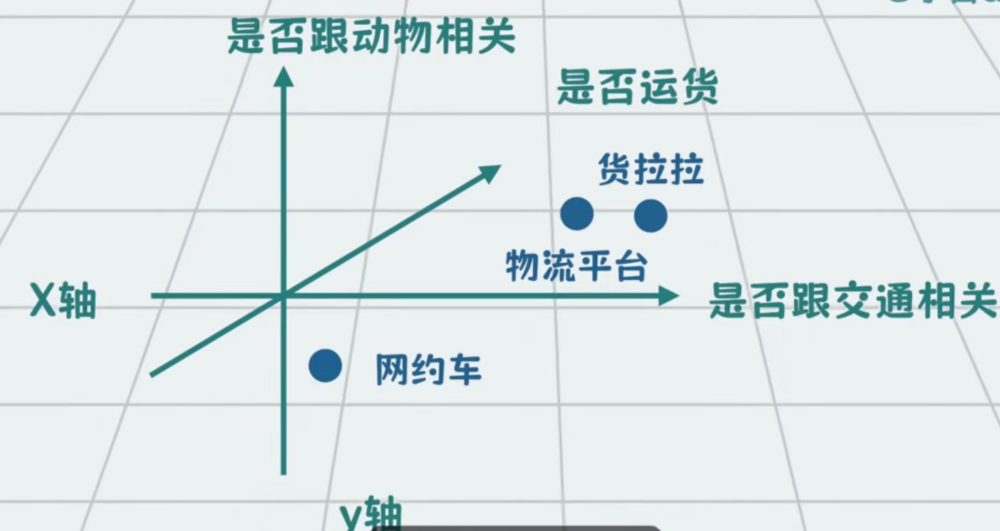
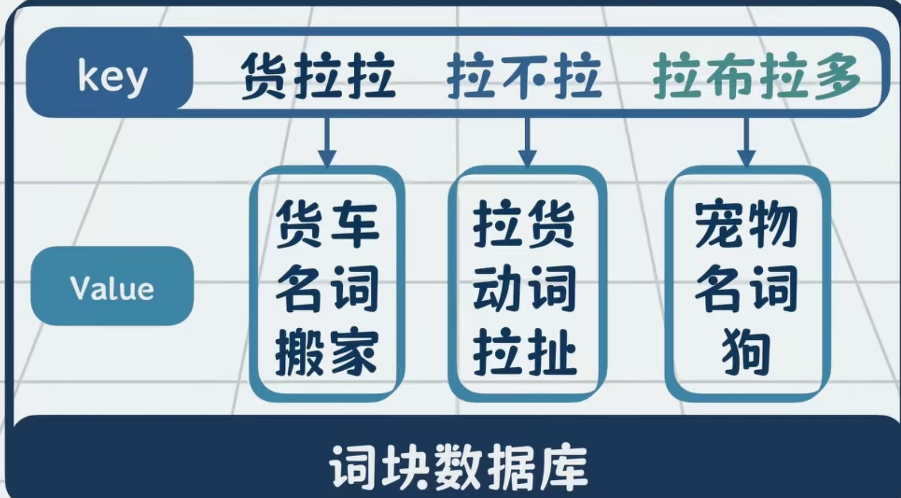

> 本来想直接上项目架构或 LLM 应用，但还是决定先打好基础。这篇文章的主角是大模型的「祖宗」——**Transformer**。

---

## 一切从 2017 年说起

2017 年，Google 发表了一篇论文：**《Attention is all you need》**。

就是这篇论文，提出了 Transformer 架构，直接催生了后来的 GPT、BERT、DeepSeek 这一整个大模型时代。

没有它，就没有现在这些能聊天、写代码、画图的 AI。

---

## 为什么计算机理解语言这么难？

先来看一个绕口令：

> **货拉拉拉不拉拉布拉多**

短短十个字，六个"拉"，你一眼就知道什么意思，但计算机表示：**臣妾做不到啊。**

问题在于，每个"拉"在不同位置代表不同的意思：

| 词语 | "拉"的含义 | 英文对应 |
|------|-----------|---------|
| 货拉拉 | 拉货（物流平台） | carry / haul |
| 拉不拉 | 拉扯、拖拽 | drag / pull |
| 拉布拉多 | 犬种名（专有名词） | Labrador |

中间的"**拉不拉**"必须结合前面的"货拉拉"和后面的"拉布拉多"才能准确理解，这对人来说是本能，对计算机来说却需要一整套机制来解决。

这就是 Transformer 要解决的核心问题：**让计算机理解一句话里每个词在上下文中的真实含义。**

---

## 第一步：把文字变成数字——Token 与 Embedding

计算机只认识 0 和 1，所以第一步是把文字转成数字。

### Token：切词

首先把句子切分成一个个词块，每个词块叫一个 **Token**：

```
货拉拉 | 拉不拉 | 拉布拉多
```

### Embedding：让数字有语义

光把字变成编号（比如 Unicode）是不够的，因为纯数字之间没有任何语义关联。

我们需要一种方式，让**语义相近的词在数字空间里也靠得近**。

想象一个坐标系：

- **二维**：X 轴表示"是否与交通相关"，Y 轴表示"是否与动物相关"



- **三维**：再加一个维度"是否运货"，货拉拉和物流就被区分出来了



维度越多，能表达的语义越丰富。实际大模型里，一个 Token 的向量维度可以达到几百甚至几千维。

这种用一组数字来表示一个词语的方式，就叫 **Embedding（词向量）**。

> 同时，模型还会给每个 Token 加入**位置信息**，因为语言的顺序很重要——「我打你」和「你打我」意思完全不同。

---

## 第二步：让词理解上下文——注意力机制（Attention）

有了 Embedding，接下来就要解决多义词的问题。

"拉不拉"在坐标系里只有一个**模糊的平均位置**，必须结合上下文才能确定它真正的含义。

### Q、K、V 是什么？

把一句话想象成一个**词块数据库**：



| 角色 | 全称 | 作用 |
|------|------|------|
| **Q**（Query） | 查询 | 当前词想查什么 |
| **K**（Key） | 键 | 数据库里每个词的"标签" |
| **V**（Value） | 值 | 每个词真正携带的语义信息 |

计算机在理解"拉不拉"时，就是拿着它的 **Q** 去跟句子里所有词的 **K** 挨个比对，看哪个词对它的参考价值更大。

为了灵活性，模型不直接用 Token 的原始向量，而是通过三个权重矩阵（WQ、WK、WV）把每个向量分别变换成专属的 Q、K、V 向量。

### 注意力分数怎么算？

$$\text{Attention}(Q, K, V) = \text{softmax}\left(\frac{QK^T}{\sqrt{d_k}}\right)V$$

用大白话解释这个公式：

1. **Q · K 点积**：计算当前词和其他词的相关程度（越同向越大）
2. **÷ √d**：缩放，防止数值过大导致梯度消失
3. **Softmax**：把相关程度转成权重，所有词的权重加起来等于 1（注意力分配比例）
4. **× V**：按权重加权所有词的语义值，得到融合了上下文的新表示

这一整套机制就叫**注意力机制（Attention）**，让每个词都能"看到"句子里其他词，并决定参考谁多、参考谁少。

---

## 第三步：多角度理解——多头注意力（Multi-Head Attention）

只算一次注意力不够，因为词与词的关系是多维的：

- 有的是**语义关联**（货拉拉 → 运货）
- 有的是**语法依赖**（主谓宾结构）
- 有的是**指代关系**（它 → 某个名词）

所以模型会**并行做多次注意力计算**，每次关注不同侧面，最后把结果拼接在一起，这就是**多头注意力（Multi-Head Attention）**。

| 单头注意力 | 多头注意力 |
|-----------|-----------|
| 只能关注一种关系 | 并行关注多种关系 |
| 理解片面 | 理解更全面 |
| 类似只用一种角度看问题 | 类似同时从多个角度分析 |

---

## 第四步：稳住数值——Add & Norm

注意力计算完之后，模型做两件事：

### Add：残差连接

把注意力的输出和**原始输入相加**，防止 Token 自身的信息被覆盖。

```
输出 = 注意力结果 + 原始输入
```

这叫**残差连接**，保证信息不丢失。

### Norm：归一化

对相加后的结果做**层归一化**，把数值稳定在合理范围内，防止数值在多层计算后失控爆炸。

---

## 第五步：增强表达能力——前馈网络（FFN）

经过注意力和 Add & Norm 之后，向量之间的变换仍然是线性的（直线），无法捕捉复杂的语义关系。

**前馈网络（Feed-Forward Network）** 通过 ReLU 等激活函数，把线性映射「掰弯」成非线性曲线，让模型具备更强的语义表达能力。

之后同样会接一次 Add & Norm。

---

## 编码器：理解输入

把上面这些组件按顺序堆叠：

```
输入 Embedding + 位置编码
        ↓
  多头注意力
        ↓
   Add & Norm
        ↓
   前馈网络 FFN
        ↓
   Add & Norm
        ↓
   （这是一个编码层）
   重复 N 次
        ↓
   编码器输出
```

多个编码层堆叠在一起构成**编码器（Encoder）**，每一层都让模型对语义的理解更深入。

**编码器的最终输出**：一组向量，是计算机对输入文本的整体语义理解。

---

## 解码器：生成输出

以翻译为例，生成英文时：

1. 放入起始符 `<BOS>`，结合编码器输出预测第一个英文词
2. 把 `<BOS>` + 第一个词作为输入，预测第二个词
3. 以此类推，逐词生成，直到出现结束符 `<EOS>`

解码器包含两个特殊的注意力：

| 注意力类型 | Q 来自 | K/V 来自 | 作用 |
|-----------|--------|---------|------|
| **带掩码的多头自注意力** | 当前生成位置 | 已生成的英文 | 保证英文内部衔接连贯 |
| **多头交叉注意力** | 当前生成位置 | 编码器输出（中文理解） | 翻译时参考原文语义 |

「带掩码」的意思是：预测第 N 个词时，只能看到前 N-1 个词，不能「偷看」后面的答案。

---

## 完整架构总览

```
         输入（中文）
              ↓
         Embedding + 位置编码
              ↓
    ┌─────────────────────┐
    │   编码器（Encoder）  │  × N层
    │  多头自注意力        │
    │  Add & Norm         │
    │  前馈网络 FFN        │
    │  Add & Norm         │
    └─────────────────────┘
              ↓
         编码器输出（语义向量）
              ↓
    ┌─────────────────────┐
    │   解码器（Decoder）  │  × N层
    │  带掩码多头自注意力  │
    │  Add & Norm         │
    │  多头交叉注意力      │
    │  Add & Norm         │
    │  前馈网络 FFN        │
    │  Add & Norm         │
    └─────────────────────┘
              ↓
         线性层 + Softmax
              ↓
         输出（英文）
```

---

## 不同架构的大模型怎么选？

并不是所有任务都需要编码器和解码器同时存在：

| 架构 | 代表模型 | 适合任务 |
|------|---------|---------|
| **仅编码器** | BERT | 文本分类、情感分析、阅读理解 |
| **仅解码器** | GPT、DeepSeek | 文本生成、对话、代码生成 |
| **编码器 + 解码器** | 原版 Transformer、T5 | 机器翻译、文本摘要 |

ChatGPT、DeepSeek 这类对话大模型采用**纯解码器架构**，把用户输入直接送进解码器理解，然后一个词一个词往后生成回复，省略了独立的编码器。

---

## 小结

| 组件 | 作用 |
|------|------|
| Token + Embedding | 把文字变成有语义的向量 |
| 位置编码 | 让模型知道词的顺序 |
| 注意力机制（Q/K/V） | 让每个词理解上下文 |
| 多头注意力 | 从多个角度理解词间关系 |
| Add & Norm | 稳定训练，防止信息丢失 |
| 前馈网络 FFN | 增强非线性表达能力 |
| 编码器 | 理解输入，输出语义向量 |
| 解码器 | 基于语义向量逐词生成输出 |

就这样，从 2017 年的一篇论文，到现在每天和你对话的大模型，核心都是这套 Transformer 架构。

不得不说，**Attention is all you need** 这个标题，起得真的很狂，也真的很准。

